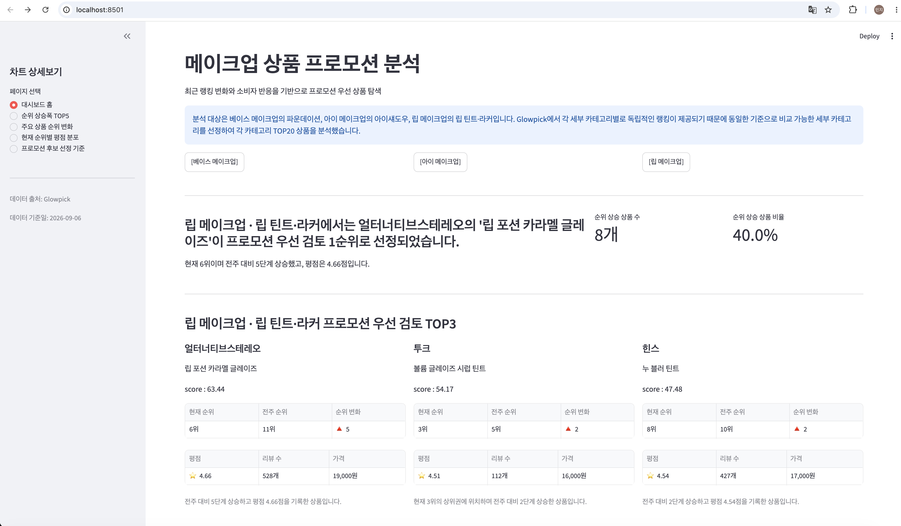
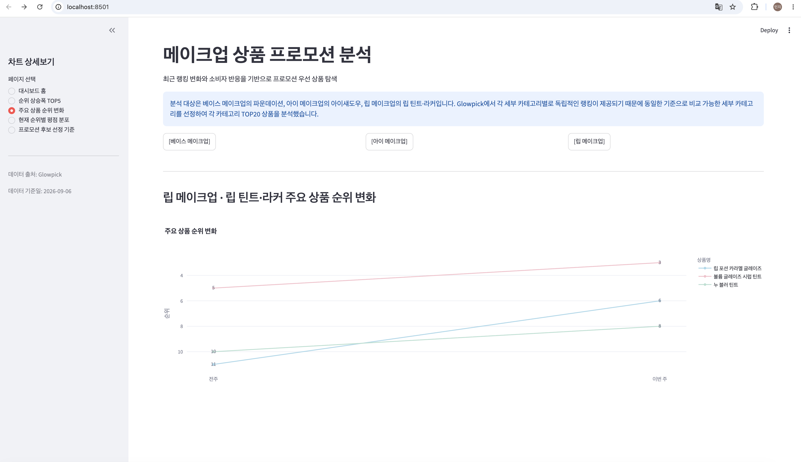
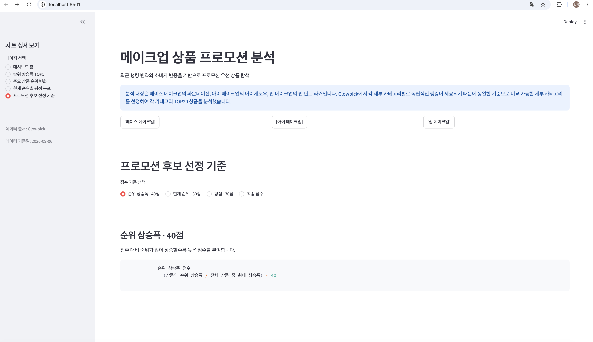

# 글로우픽 메이크업 상품 데이터를 활용한 프로모션 우선 검토 상품 분석

## 1. 프로젝트 개요

본 프로젝트는 글로우픽 메이크업 상품 데이터를 활용하여 전주 대비 순위 변화를 통해 최근 주목도가 상승한 상품을 파악하고, 평점 등의 소비자 반응을 종합하여 프로모션 대상으로 우선 검토할 상품을 선정하는 것을 목적으로 한다.

분석 대상은 베이스 메이크업의 파운데이션, 아이 메이크업의 아이섀도우, 립 메이크업의 립 틴트·라커이며, 각 카테고리별 TOP20 상품을 수집하여 총 60개 상품을 분석하였다.


## 2. 실행 방법

### 1. 데이터베이스 테이블 생성

MariaDB에서 `db/schema.sql` 파일의 SQL문을 실행하여 프로젝트에 필요한 테이블을 생성한다.

### 2. 데이터 파이프라인 실행

프로젝트 루트 디렉터리에서 다음 명령어를 실행한다.

```bash
python -m collector
```

### 3. 분석용 데이터 생성

MariaDB에서 `db/build_mart.sql` 파일의 SQL문을 실행하여 대시보드에서 사용할 분석용 데이터를 생성한다.

### 4. Streamlit 대시보드 실행

```bash
streamlit run app/main.py
```

## 3. 주요 분석 결과

### 베이스 메이크업 · 파운데이션

웨이크메이크의 '스킨 퍼펙팅 커버 쿠션 [SPF40/PA++]'이 프로모션 우선 검토 1순위로 선정되었다.

해당 상품은 전주 대비 15단계 상승했으며, 순위 상승폭과 현재 순위, 평점을 종합한 프로모션 점수에서 76.32점을 기록하였다.

### 아이 메이크업 · 아이섀도우

홀리카홀리카의 '소프튠 무드 팔레트'가 프로모션 우선 검토 1순위로 선정되었다.

해당 상품은 전주 대비 10단계 상승했으며, 순위 상승폭과 현재 순위, 평점을 종합한 프로모션 점수에서 92.53점을 기록하였다.

### 립 메이크업 · 립 틴트·라커

얼터너티브스테레오의 '립 포션 카라멜 글레이즈'가 프로모션 우선 검토 1순위로 선정되었다.

해당 상품은 전주 대비 5단계 상승했으며, 순위 상승폭과 현재 순위, 평점을 종합한 프로모션 점수에서 92.11점을 기록하였다.


## 4. 프로젝트 구조

```text
mini-pjt-2/
├── README.md                           # 프로젝트 개요 · 실행 방법 · 주요 결과
├── .env.example                       # 환경변수 예시 (실제 값 제외)
├── .gitignore                         # Git 제외 파일 설정
├── requirements.txt                   # 프로젝트 실행에 필요한 Python 패키지
│
├── collector/                         # ① 데이터 수집 · 전처리 계층
│   ├── __main__.py                    # 수집 실행 진입점: python -m collector
│   ├── config.py                      # Glowpick 카테고리 URL 설정
│   ├── crawler.py                     # 상품 크롤링 · 재시도 · 요청 딜레이
│   ├── transform.py                   # 데이터 정제 · 타입 변환
│   ├── score.py                       # 프로모션 우선순위 점수 계산
│   └── loader.py                      # 정제 데이터 DB 적재
│
├── data/
│   └── raw/
│       ├── glowpick_20260906.csv       # 크롤링 원본 데이터
│       └── glowpick_20260906_clean.csv # 정제 완료 데이터
│
├── db/                                # ② 데이터 저장 · 분석 계층
│   ├── README.md                      # DB 테이블 구조 · 목적 · 입도 · 단위 설명
│   ├── schema.sql                     # 테이블 생성 DDL · PK · UNIQUE 설정
│   └── build_mart.sql                 # JOIN 및 대시보드용 분석 데이터 생성 SQL
│
├── app/                               # ③ Streamlit 대시보드 계층
│   ├── main.py                        # Streamlit 실행 진입점
│   ├── repository.py                  # DB 조회 함수 · 캐싱
│   ├── components.py                  # KPI · TOP3 카드 · 사이드바 · 상세표
│   ├── charts.py                      # 분석 차트 생성
│   └── colors.py                      # 대시보드 차트 색상 관리
│
└── report/
    └── report.md                      # 프로젝트 분석 리포트
```


## 5. 대시보드

## 대시보드

**대시보드 배포 링크:** [Streamlit 대시보드 바로가기](https://mini-pjt-2-minji-cfp3fjcnt8v4e7h66mnx3b.streamlit.app/)

### 대시보드 메인 화면

카테고리를 선택하여 베이스 메이크업, 아이 메이크업, 립 메이크업별 프로모션 우선 검토 상품과 주요 분석 결과를 확인할 수 있다.




### 주요 상품 순위 변화

전주와 이번 주의 상품 순위를 비교하여 최근 주목도가 상승한 주요 상품의 순위 변화를 확인할 수 있다.




### 프로모션 후보 선정 기준

순위 상승폭, 현재 순위, 평점을 종합하여 프로모션 점수를 산정하고 우선 검토 상품을 선정하였다.

